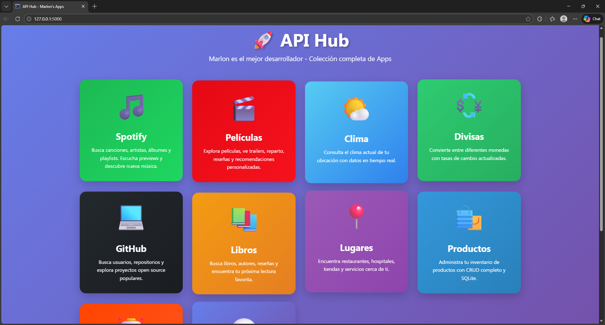
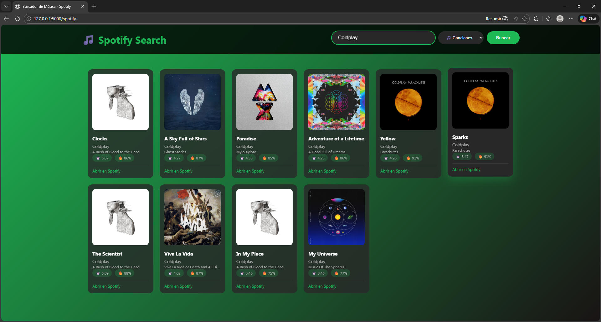
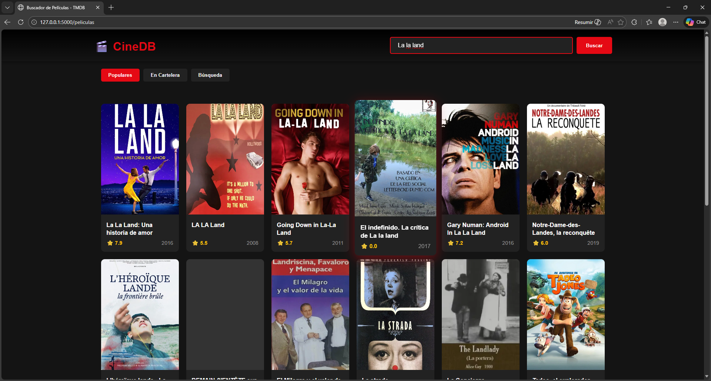
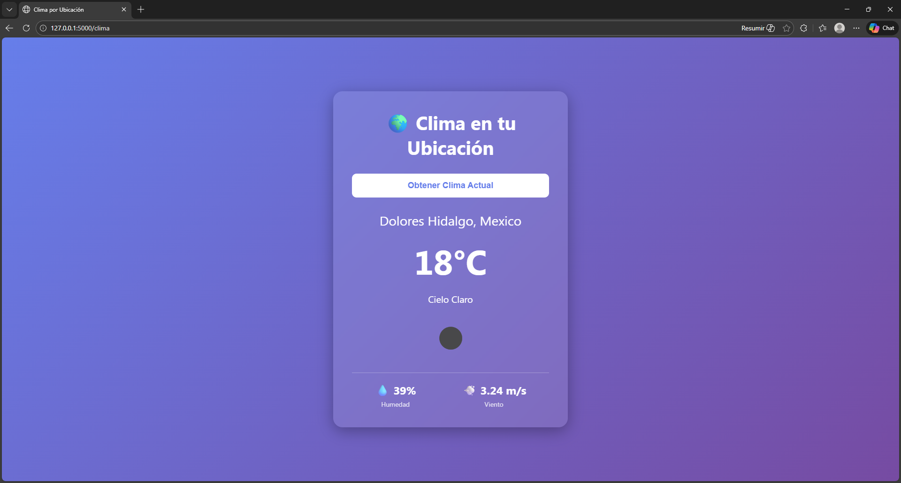
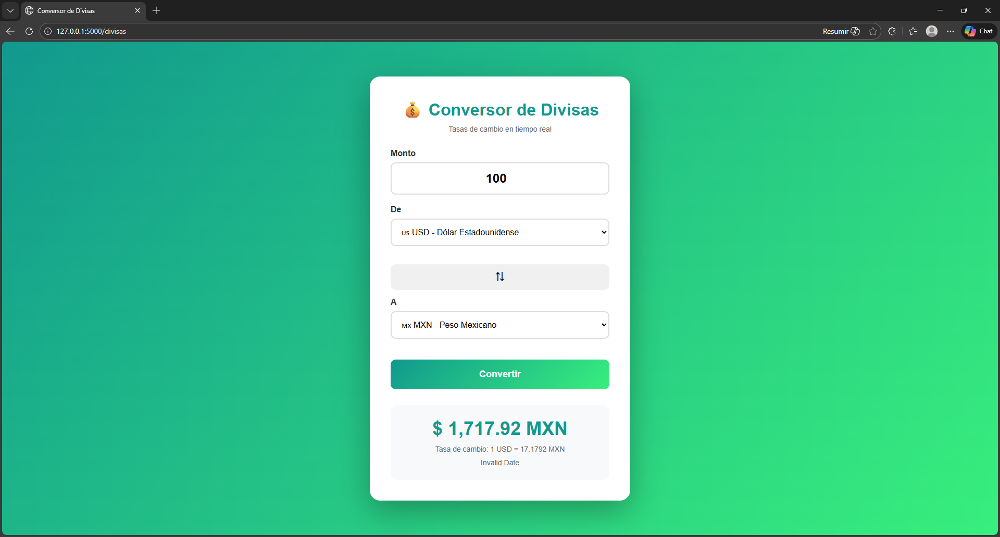
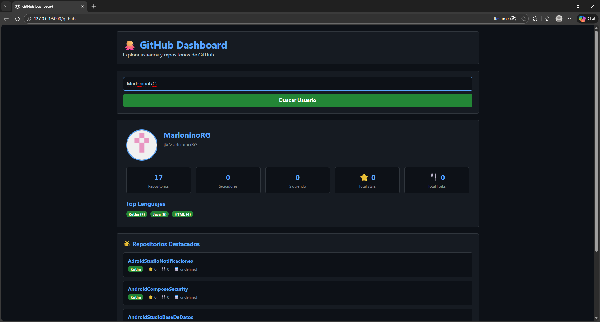
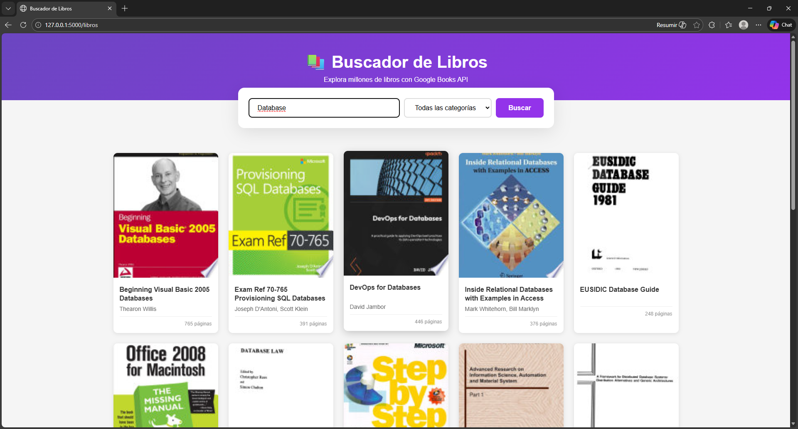
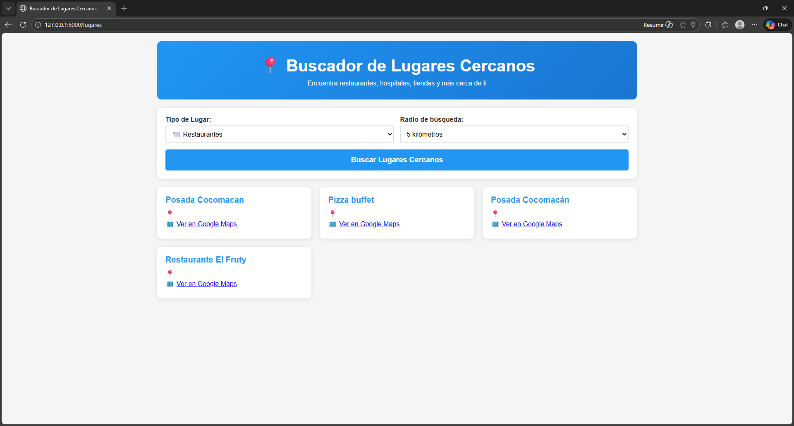
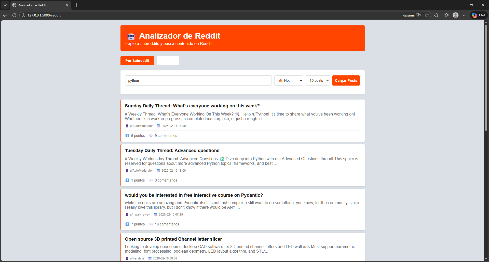
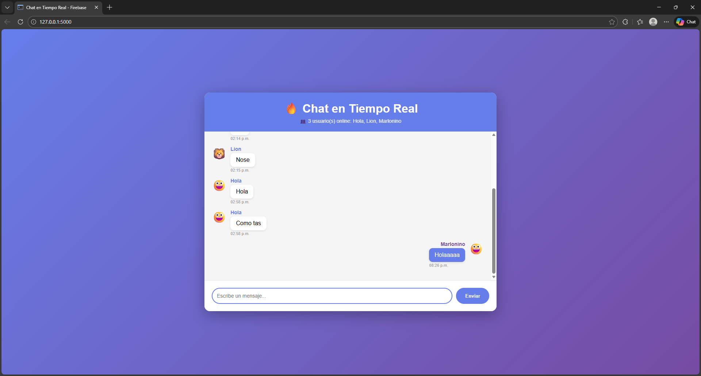

# 🚀 API Hub - Colección de Apps

Una aplicación web unificada que integra múltiples APIs en una sola plataforma. Desarrollado con Flask y Python.


---

## 📸 Vista Previa

### Dashboard Principal


### Apps Integradas

#### 🎵 Spotify

Busca canciones, artistas, álbumes y playlists. Escucha previews de 30 segundos.

#### 🎬 Películas (TMDB)

Explora películas, ve trailers, reparto, reseñas y recomendaciones personalizadas.

#### 🌤️ Clima

Consulta el clima actual de tu ubicación con datos en tiempo real.

#### 💱 Divisas

Convierte entre diferentes monedas con tasas de cambio actualizadas al instante.

#### 💻 GitHub

Busca usuarios, repositorios y explora proyectos open source populares.

#### 📚 Libros

Encuentra libros con Google Books API, lee reseñas y vista previa.

#### 📍 Lugares

Localiza restaurantes, hospitales, tiendas y servicios cercanos con OpenStreetMap.

#### 🛍️ Productos

Sistema CRUD completo para gestión de inventario con SQLite.

#### 🤖 Reddit

Explora posts trending, busca en subreddits y mantente al día.

#### 💬 Chat

Chat en tiempo real con Firebase. Conecta con otros usuarios al instante.

---

## 🌟 Características

### Aplicaciones Disponibles

| App | Descripción | API Utilizada |
|-----|-------------|---------------|
| 🎵 **Spotify** | Busca canciones, artistas, álbumes y playlists | Spotify Web API |
| 🎬 **Películas** | Explora películas, trailers, reparto y recomendaciones | TMDB API |
| 🌤️ **Clima** | Consulta el clima en tiempo real | OpenWeather API |
| 💱 **Divisas** | Convierte entre diferentes monedas | ExchangeRate API |
| 💻 **GitHub** | Busca usuarios, repositorios y estadísticas | GitHub API |
| 📚 **Libros** | Encuentra libros y reseñas | Google Books API |
| 📍 **Lugares** | Localiza servicios cercanos | OpenStreetMap API |
| 🛍️ **Productos** | Gestión completa de inventario | SQLite (CRUD) |
| 🤖 **Reddit** | Explora posts y subreddits | Reddit API |
| 💬 **Chat** | Chat en tiempo real | Firebase Realtime Database |

---

## 📋 Requisitos Previos

- Python 3.8 o superior
- pip (gestor de paquetes de Python)
- Git
- Cuenta en las siguientes plataformas para obtener API keys:
  - [Spotify for Developers](https://developer.spotify.com/dashboard)
  - [The Movie Database (TMDB)](https://www.themoviedb.org/settings/api)
  - [OpenWeatherMap](https://openweathermap.org/api)
  - [ExchangeRate API](https://www.exchangerate-api.com/)
  - [Firebase](https://console.firebase.google.com/) (para chat)

---

## 🚀 Instalación Rápida

### 1. **Clonar el repositorio**
```bash
git clone https://github.com/TU_USUARIO/api-hub.git
cd api-hub
```

### 2. **Crear entorno virtual**
```bash
python -m venv venv

# En Windows:
venv\Scripts\activate

# En Mac/Linux:
source venv/bin/activate
```

### 3. **Instalar dependencias**
```bash
pip install -r requirements.txt
```

### 4. **Configurar variables de entorno**

Copia el archivo de ejemplo:
```bash
cp .env.example .env
```

Edita `.env` y agrega tus API keys:
```env
SPOTIFY_CLIENT_ID=tu_client_id
SPOTIFY_CLIENT_SECRET=tu_client_secret
TMDB_API_KEY=tu_api_key
WEATHER_API_KEY=tu_api_key
EXCHANGE_API_KEY=tu_api_key
```

**Dónde obtener las API keys:**
- **Spotify**: [developer.spotify.com/dashboard](https://developer.spotify.com/dashboard)
- **TMDB**: [themoviedb.org/settings/api](https://www.themoviedb.org/settings/api)
- **OpenWeather**: [openweathermap.org/api](https://openweathermap.org/api)
- **ExchangeRate**: [exchangerate-api.com](https://www.exchangerate-api.com/)
- **Firebase**: [console.firebase.google.com](https://console.firebase.google.com/)

### 5. **Ejecutar la aplicación**
```bash
python main_app.py
```

### 6. **Abrir en el navegador**
```
http://127.0.0.1:5000
```

---

## 📁 Estructura del Proyecto
```
api-hub/
│
├── main_app.py                 # Aplicación principal con todas las APIs
├── requirements.txt            # Dependencias del proyecto
├── .env                        # Variables de entorno (NO SUBIR A GIT)
├── .env.example               # Plantilla de variables de entorno
├── .gitignore                 # Archivos a ignorar en Git
├── README.md                  # Este archivo
│
├── templates/                 # Plantillas HTML
│   ├── index.html            # Dashboard principal
│   ├── spotify.html          # Interfaz de Spotify
│   ├── peliculas.html        # Interfaz de películas
│   ├── clima.html            # Interfaz del clima
│   ├── divisas.html          # Interfaz de divisas
│   ├── github.html           # Interfaz de GitHub
│   ├── libros.html           # Interfaz de libros
│   ├── lugares.html          # Interfaz de lugares
│   ├── productos.html        # Interfaz de productos
│   ├── reddit.html           # Interfaz de Reddit
│   └── chat.html             # Interfaz de chat
│
├── static/                    # Archivos estáticos
│   ├── css/                  # Estilos CSS
│   ├── js/                   # JavaScript
│   └── img/                  # Imágenes
│
├── screenshots/               # Capturas de pantalla para README
│   ├── dashboard.png
│   ├── spotify.png
│   ├── peliculas.png
│   ├── clima.png
│   ├── divisas.png
│   ├── github.png
│   ├── libros.png
│   ├── lugares.png
│   ├── productos.png
│   ├── reddit.png
│   ├── chat.png
│   └── demo/
│       ├── spotify-demo.gif
│       ├── peliculas-demo.gif
│       ├── clima-demo.gif
│       └── productos-demo.gif
│
└── productos.db               # Base de datos SQLite (se crea automáticamente)
```

---

## 🛠️ Tecnologías Utilizadas

### Backend


### Frontend


### APIs Externas
- **Spotify API** - Búsqueda de música
- **TMDB (The Movie Database)** - Información de películas
- **OpenWeather API** - Datos meteorológicos
- **ExchangeRate API** - Tasas de cambio
- **GitHub API** - Información de repositorios
- **Google Books API** - Catálogo de libros
- **Reddit API** - Posts y subreddits
- **Firebase Realtime Database** - Chat en tiempo real
- **OpenStreetMap Overpass API** - Lugares cercanos

---

## 🎯 Endpoints API

### 🎵 Spotify
```
GET  /api/spotify/buscar?q={query}&tipo={track|artist|album|playlist}
GET  /api/spotify/artista/<artist_id>
GET  /api/spotify/album/<album_id>
```

### 🎬 Películas
```
GET  /api/peliculas/buscar?q={query}
GET  /api/peliculas/<movie_id>
GET  /api/peliculas/populares
```

### 🌤️ Clima
```
GET  /api/clima
```

### 💱 Divisas
```
GET  /api/divisas/convertir?monto={amount}&de={from}&a={to}
GET  /api/divisas/monedas
```

### 💻 GitHub
```
GET  /api/github/usuario/<username>
GET  /api/github/buscar/repos?q={query}
```

### 📚 Libros
```
GET  /api/libros/buscar?q={query}
```

### 🤖 Reddit
```
GET  /api/reddit/posts?subreddit={name}&filtro={hot|new|top}
GET  /api/reddit/subreddits/populares
```

### 🛍️ Productos (CRUD)
```
GET     /api/productos              # Listar todos
GET     /api/productos/<id>         # Obtener uno
POST    /api/productos              # Crear nuevo
PUT     /api/productos/<id>         # Actualizar
DELETE  /api/productos/<id>         # Eliminar
```

### 📍 Lugares
```
GET  /api/lugares?lat={lat}&lon={lon}&tipo={restaurant|hospital|cafe}
```

---

## 💻 Uso de las Apps

### Spotify


1. Ingresa el nombre de una canción, artista o álbum
2. Selecciona el tipo de búsqueda
3. Haz clic en "Buscar"
4. Escucha previews de 30 segundos
5. Abre en Spotify para ver más detalles

### Películas


1. Busca películas por título
2. Ve trailers en YouTube
3. Explora el reparto y crew
4. Descubre películas similares

### Clima


La app detecta automáticamente tu ubicación y muestra:
- Temperatura actual
- Descripción del clima
- Humedad
- Velocidad del viento

### Productos (CRUD)


1. **Crear**: Agrega nuevos productos al inventario
2. **Leer**: Visualiza todos los productos
3. **Actualizar**: Edita información de productos
4. **Eliminar**: Borra productos del inventario

---

## 🔧 Configuración Avanzada

### Cambiar Puerto
Edita tu archivo `.env`:
```env
FLASK_PORT=8080
```

### Modo Producción
```env
FLASK_DEBUG=False
```

### Personalizar Base de Datos
```env
DATABASE_NAME=mi_inventario.db
```

---

## 🐛 Solución de Problemas

### Error: "ModuleNotFoundError"
```bash
pip install -r requirements.txt
```

### Error: "API Key inválida"
Verifica que:
1. Copiaste correctamente las API keys en `.env`
2. Las API keys están activas en sus respectivas plataformas
3. No hay espacios extra en el archivo `.env`

### Error: "Port already in use"
Cambia el puerto en `.env`:
```env
FLASK_PORT=8080
```

### Base de datos corrupta
Elimina `productos.db` y reinicia la app (se recreará automáticamente)

---

## 📊 Estadísticas del Proyecto


```
┌─────────────────────────────────────┐
│  📈 Estadísticas del Proyecto       │
├─────────────────────────────────────┤
│  Líneas de código:    ~3,000+       │
│  APIs integradas:     10             │
│  Endpoints totales:   30+            │
│  Tecnologías:         5              │
│  Tiempo desarrollo:   Variable       │
└─────────────────────────────────────┘
```

---

## 🤝 Contribuciones

¡Las contribuciones son bienvenidas! Sigue estos pasos:

### 1. Fork el proyecto

Haz clic en el botón "Fork" en la esquina superior derecha del repositorio.

<p align="center">
  
</p>

### 2. Crea una rama
```bash
git checkout -b feature/nueva-funcionalidad
```

### 3. Haz commit de tus cambios
```bash
git commit -m 'Add: Nueva funcionalidad increíble'
```

### 4. Push a la rama
```bash
git push origin feature/nueva-funcionalidad
```

### 5. Abre un Pull Request

**Paso 1:** Ve a tu fork en GitHub  
Verás un mensaje que dice **"This branch is X commits ahead"** y un botón **"Contribute"**. Haz clic en "Contribute" → "Open pull request"

**Paso 2:** Completa el formulario  
- **Título:** Describe brevemente tu cambio (ej: "Add: Sistema de notificaciones")
- **Descripción:** Explica qué hace tu cambio y por qué es útil

**Paso 3:** Envía el PR  
Haz clic en **"Create pull request"** y ¡listo! 🎉

> 💡 **Tip:** Asegúrate de que tu rama esté actualizada con la rama principal antes de crear el PR

### Guía de Contribución

- ✅ Escribe código limpio y documentado
- ✅ Sigue el estilo de código existente
- ✅ Actualiza el README si es necesario
- ✅ Prueba tu código antes de hacer PR
- ✅ Describe claramente tus cambios

---

## 📝 Roadmap

### ✅ Fase 1 - Completada
- [x] Integración de 10 APIs diferentes
- [x] Dashboard principal unificado
- [x] Sistema CRUD con SQLite
- [x] Chat en tiempo real con Firebase

### 🚧 Fase 2 - En Desarrollo
- [ ] Autenticación de usuarios
- [ ] Favoritos y listas personalizadas
- [ ] Modo oscuro
- [ ] Búsqueda global en todas las apps
- [ ] Caché de resultados

### 📅 Fase 3 - Futuro
- [ ] App móvil con React Native
- [ ] Notificaciones push
- [ ] Integración con más APIs
- [ ] Panel de administración
- [ ] Docker containerization

---

## 📄 Licencia

Este proyecto está bajo la Licencia MIT - ver el archivo [LICENSE](LICENSE) para más detalles.
```
MIT License

Copyright (c) 2024 Marlon Rojas

Permission is hereby granted, free of charge, to any person obtaining a copy
of this software and associated documentation files (the "Software"), to deal
in the Software without restriction...
```

---

## 👨‍💻 Autor

**Marlon Rojas** - *El Mejor Desarrollador*

[](https://github.com/TU_USUARIO)
[](https://linkedin.com/in/TU_USUARIO)
[](https://twitter.com/TU_USUARIO)

---

## 🙏 Agradecimientos

- **Spotify** por su increíble API de música
- **TMDB** por la mejor base de datos de películas
- **OpenWeather** por datos meteorológicos precisos
- **Firebase** por el servicio de base de datos en tiempo real
- **GitHub** por alojar este proyecto
- **La comunidad Open Source** por hacer esto posible

---

## ⚠️ Notas Importantes

### Seguridad
- ⚠️ **NUNCA** subas tu archivo `.env` a GitHub
- ⚠️ **NUNCA** expongas tus API keys públicamente
- ⚠️ Usa el archivo `.env.example` como plantilla
- ⚠️ Revisa el `.gitignore` antes de hacer commit

### Límites de las APIs
Algunas APIs tienen límites de requests:
- **Spotify**: 1,000 requests/día (gratis)
- **TMDB**: 1,000 requests/día (gratis)
- **OpenWeather**: 1,000 requests/día (gratis)
- **ExchangeRate**: 1,500 requests/mes (gratis)

Para uso en producción, considera planes pagados.

---

## 📞 Contacto y Soporte

¿Tienes preguntas? ¿Encontraste un bug?

- 📧 Email: tu-email@ejemplo.com
- 💬 GitHub Issues: [Reportar un problema](https://github.com/TU_USUARIO/api-hub/issues)
- 📖 Wiki: [Documentación completa](https://github.com/TU_USUARIO/api-hub/wiki)

---

## ⭐ Dale una Estrella

Si este proyecto te ayudó o te pareció interesante, ¡dale una estrella en GitHub!

<p align="center">
  
</p>

---

<div align="center">

**Hecho con ❤️ y mucho ☕ por Marlon Rojas**


### *API Hub - Todas tus apps favoritas en un solo lugar*

---

[](https://forthebadge.com)
[](https://forthebadge.com)
[](https://forthebadge.com)

[⬆ Volver arriba](#-api-hub---colección-de-apps)

</div>
```

---

## 📸 Estructura de screenshots SIMPLIFICADA

Ahora solo necesitas crear screenshots de TUS apps:
```
screenshots/
├── dashboard.png          # Solo esto necesitas crear
├── spotify.png           # Captura de tu app Spotify
├── peliculas.png         # Captura de tu app Películas
├── clima.png             # Captura de tu app Clima
├── divisas.png           # Captura de tu app Divisas
├── github.png            # Captura de tu app GitHub
├── libros.png            # Captura de tu app Libros
├── lugares.png           # Captura de tu app Lugares
├── productos.png         # Captura de tu app Productos
├── reddit.png            # Captura de tu app Reddit
├── chat.png              # Captura de tu app Chat
└── demo/                 # (Opcional) GIFs de demos
    ├── spotify-demo.gif
    ├── peliculas-demo.gif
    ├── clima-demo.gif
    └── productos-demo.gif
